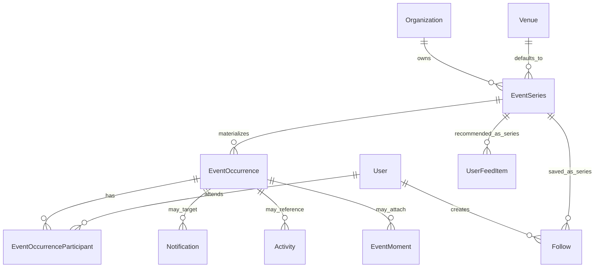
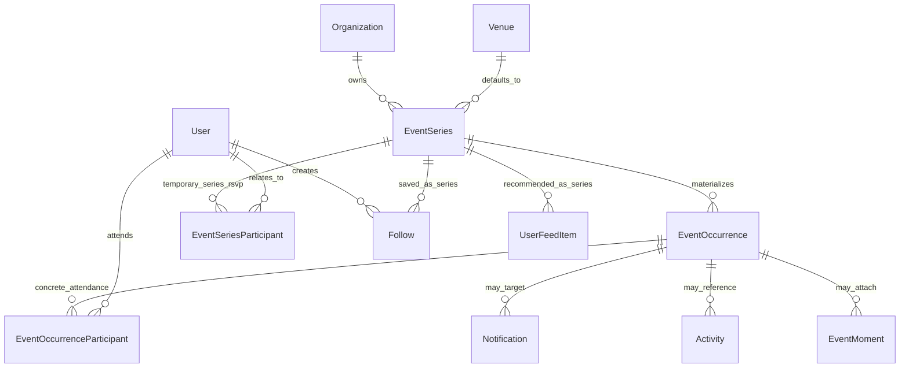
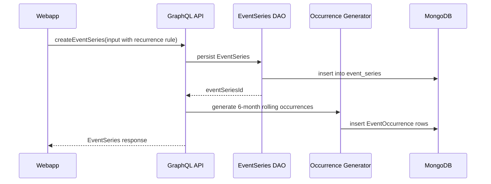
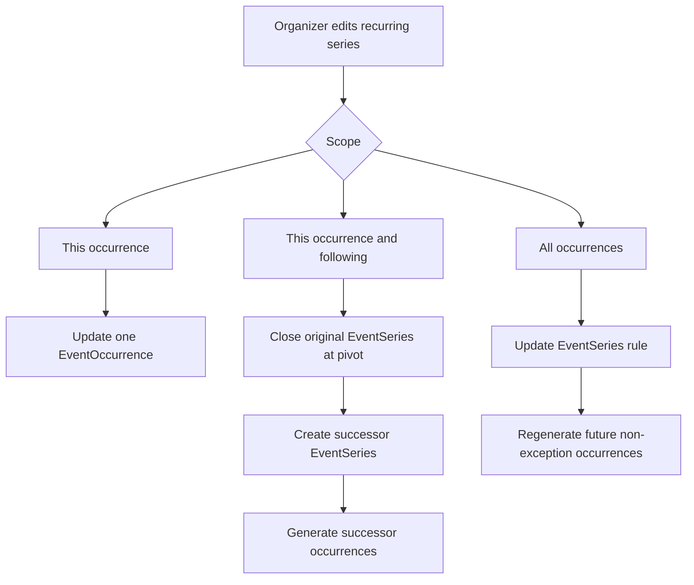

# Recurring Events Architecture

## Executive Summary

Gatherle currently stores recurrence information on the existing `Event` model, but the platform still behaves as if an
event has only one concrete date. The recurrence rule exists, the `rrule` library is already available, and parts of the
API can already answer limited recurrence questions. The missing piece is not recurrence syntax. The missing piece is a
first-class model for real scheduled instances.

The required feature set is now clear. We need per-occurrence RSVP. We need the ability to cancel one occurrence without
cancelling the whole recurring program. We need to edit one Tuesday without editing every other Tuesday. We need
calendar-grade date queries that remain fast as the data set grows. Once those requirements are in scope, the current
"one event record plus one RRULE string" design is no longer the right shape.

The original version of this document proposed keeping the current `Event` model name and treating it as the series
record. After further review, the recommended direction is now stronger and more explicit: **rename the current `Event`
model to `EventSeries` first, then build occurrence support on top of that clearer vocabulary**.

That rename is worth doing now because this project is still in the development stage. We are not trying to preserve a
production database, preserve legacy table names, or avoid a data reset. We can drop and recreate the current event and
participant collections as part of this initiative. That freedom changes the recommendation materially. If we know the
correct long-term vocabulary, we should adopt it now rather than carry ambiguous names through every later phase.

The resulting architecture has three main scheduling entities:

`EventSeries` is the parent business object that organizers create and manage. It holds the title, description,
organizers, organization ownership, categories, venue defaults, media, visibility, and recurrence definition.

`EventOccurrence` is one concrete scheduled instance of that series. It is the thing that happens on a real date and
time. It is what users discover in calendar-oriented views and what organizers cancel or move when only one session
changes.

`EventOccurrenceParticipant` is the occurrence-level attendance record. It makes per-occurrence RSVP, waitlists,
check-in, reminders, and counts possible.

One important clarification: `EventSeriesParticipant` is **not** part of the desired long-term architecture. It appears
later in this document only as a **temporary transitional model** that may exist during the pull-request-based rollout.
The intended steady state is series plus occurrence plus occurrence participant, with attendance ultimately living on
occurrences.

This document explains that architecture in detail, locks the key implementation decisions that must be made before work
starts, and lays out a pull-request-based rollout plan so the initiative can move forward one stable step at a time.

---

## Why This Change Is Necessary

Today the platform has one embedded schedule on the parent event and a participation model that points at `eventId`.
That design works well only for single-date events or for a lightweight interpretation of recurrence.

It breaks down in four places.

The first breakdown is discovery. The API can sometimes determine that a recurring series should appear inside a given
date window, but once it returns that series, the consumer still receives one parent object rather than one concrete
session. There is no durable concept of "the 14 January occurrence" as distinct from "the 21 January occurrence".

The second breakdown is attendance. The current participant record answers "is this user linked to this event?" but it
cannot answer "is this user going to this specific session but not the following session?".

The third breakdown is mutation scope. A recurring rule is a good description of a default pattern, but it is not a good
place to accumulate many one-off operational truths. A cancelled session, a moved session, or a special one-time venue
change wants to live on a concrete occurrence object, not in a more and more complicated series definition.

The fourth breakdown is performance. Calendar queries, reminder jobs, capacity dashboards, and attendance analytics are
all naturally occurrence-based. They want real persisted `startAt` and `endAt` values that can be indexed. Repeatedly
expanding RRULE strings in application code after reading series documents becomes both inefficient and semantically
awkward.

The implication is straightforward. We do not need a more clever RRULE parser. We need a clearer domain model.

---

## Locked Design Decisions

### Naming Reset

The current `Event` model will be renamed to `EventSeries`.

The current `EventParticipant` model will be renamed to `EventSeriesParticipant` as part of the same initial refactor.
This makes its temporary semantics explicit and prevents the codebase from carrying an ambiguous participant model while
occurrence participation is introduced in later phases.

The product can continue to use the word "event" in routes and UI copy. This rename is primarily about code, schema, and
data-model clarity. Public URLs such as `/events/:slug` can remain unchanged.

### `occurrenceKey` Format

`occurrenceKey` will be a required, uniquely indexed idempotency key on `EventOccurrence`.

The format is locked as:

```text
${eventSeriesId}#${originalStartAt.toISOString()}
```

This key is stable across regeneration. It identifies the intended occurrence slot, not the current edited state of that
slot. That distinction is important. If a specific occurrence is moved from 19:00 to 20:00 as a one-off override, its
`occurrenceKey` still reflects the original scheduled time produced by the series rule. That is what allows the
regenerator to reconcile existing rows correctly rather than creating duplicates.

The `#` separator is intentional. It is visually distinct from the timestamp itself and from typical identifier
characters, which makes the boundary between series id and scheduled start clearer in logs, debugging output, and manual
inspection. Because `occurrenceKey` is an internal idempotency key rather than a user-facing URL path segment, using `#`
here is acceptable.

### Rolling Window Policy

The rolling occurrence materialization window for MVP is locked at **six months**.

The system should top up the future horizon whenever the remaining materialized future window drops below **30 days**.
This gives the product enough forward visibility for discovery, reminders, and organizer management while keeping write
amplification and storage growth reasonable.

Six months is the correct MVP compromise. It is materially safer than twelve months for high-frequency daily
recurrences, but it is still long enough for most practical discovery and management use cases.

### Dev-Stage Data Reset Strategy

This initiative will begin with a **deliberate data reset**.

We will drop the current event and participant collections as we start the work. That means this architecture does not
need to preserve stale development data, design around fragile backfills, or carry transitional compromises only to
support current development fixtures. The goal is to arrive at a cleaner system, not to preserve a temporary dataset.

This decision removes the biggest source of hesitation from the original document. We do not need a cautious legacy-data
migration policy to start this initiative. We can rebuild the data model cleanly and reseed development data and mocks
on top of it.

### Split-Series URL Continuity

When an organizer chooses "this occurrence and following", the system will create a new `EventSeries` record for the
future schedule branch.

That new series gets its own slug. The original series should record a successor reference, such as
`splitIntoEventSeriesId`, and optionally `splitIntoSlug` for convenience.

The organizer flow should redirect to the new series slug immediately after a successful split so the editor remains on
the active branch they just created.

The old series detail page should be able to surface a banner such as:

"This series changed from 12 August onward. View the updated series."

This is the correct UX because a split is not merely an internal scheduling operation. It creates a new canonical series
branch that users and organizers may need to navigate between.

### Cancelled Occurrence Deep Links

If the webapp loads an occurrence-specific deep link and that occurrence has already been cancelled, the detail page
should not fail silently.

The page should show a clear cancelled-occurrence banner and offer a direct action to jump to the next active upcoming
occurrence for that same series. This is required both for organizer confidence and for notification/deep-link
correctness.

---

## Core Conceptual Model

The platform should explicitly distinguish between a **series** and an **occurrence**.

An `EventSeries` is the durable object that represents what the organizer actually created. It has identity, content,
ownership, policies, visibility, media, and a scheduling rule. It is the thing users conceptually follow or save. It is
the thing that lives at `/events/:slug`.

An `EventOccurrence` is one concrete scheduled instance of that series. It has a real start time, a real end time, a
real status, and possibly one-off operational overrides. It is the thing users attend, receive reminders for, or see in
calendar-based views.

An `EventOccurrenceParticipant` is one user's relationship to one concrete occurrence. It is the thing that powers
occurrence-level RSVP, waitlisting, check-in, and reminders.

The entire redesign becomes much easier to reason about once these three layers are named clearly.

---

## Why We Should Rename `Event` to `EventSeries`

In a production system with heavy legacy coupling, keeping the old `Event` name might be the pragmatic call. That is no
longer the best choice here.

We are still in development. We know the current word "event" is overloaded. Sometimes it means the series definition.
Sometimes it means the concrete scheduled thing a user is attending. That ambiguity is exactly what caused confusion in
the first place.

If we leave the name as `Event` and merely tell ourselves that it "really means series now", then every future phase has
to remember that hidden semantic shift. Every new engineer has to internalize it. Every later PR has to be read through
that lens. That is avoidable.

Renaming now gives the codebase a durable vocabulary:

`EventSeries` is the parent.

`EventOccurrence` is the child.

`EventSeriesParticipant` is the temporary legacy-style participant model.

`EventOccurrenceParticipant` is the target attendance model for recurring logic and, later, for full unification.

That clarity is worth the upfront rename cost. It will simplify every subsequent phase.

---

## Proposed Data Model

### `EventSeries`

`EventSeries` is the renamed version of today's parent event record.

It remains the authoritative source of:

the title, summary, description, organizers, organization ownership, categories, media, event link, privacy settings,
visibility, default venue/location, tags, additional details, lifecycle status, and the recurrence definition itself.

Its embedded schedule still matters, but the semantics need to be precise.

`primarySchedule.startAt` and `primarySchedule.endAt` should represent the **first concrete occurrence** of the series,
not the lifespan of the entire recurring program. That first occurrence gives the system a template start time, a
template end time, and therefore a default duration. The recurrence rule then describes how that first concrete session
repeats.

The series stopping point belongs either in the RRULE via `UNTIL` or `COUNT`, or in a normalized companion field if we
choose to add one later. It does not belong in `endAt` if `endAt` is being used to express the end time of one
occurrence.

`EventSeries` should also gain a small number of internal operational fields. The most important one is a schedule
version so regenerated occurrences can be tied back to the series definition that produced them. If series splits become
first-class workflow, the series should also gain split lineage fields such as `splitFromEventSeriesId` and
`splitIntoEventSeriesId`.

### `EventOccurrence`

`EventOccurrence` is the new concrete scheduling layer.

Every row in this collection represents one actual scheduled session. That is true for recurring series, and in the
long-term unified design it will also be true for single-date series. However, the rollout plan below deliberately keeps
those two concerns separate at first. We do not need to move all single-date flows on day one to still gain real value
from occurrence modelling for recurrence.

At a minimum, `EventOccurrence` should store the following:

| Field                   | Meaning                                                                                 |
| ----------------------- | --------------------------------------------------------------------------------------- |
| `occurrenceId`          | Stable primary identifier for the concrete occurrence                                   |
| `eventSeriesId`         | Foreign key to the parent series                                                        |
| `occurrenceKey`         | Stable regeneration key in the form `${eventSeriesId}#${originalStartAt.toISOString()}` |
| `originalStartAt`       | The schedule-generated start before any one-off override                                |
| `startAt`               | The actual current start time of this occurrence                                        |
| `endAt`                 | The actual current end time of this occurrence                                          |
| `timezone`              | The timezone used to display and interpret this occurrence                              |
| `status`                | Scheduled, Cancelled, Completed, or another explicit occurrence state                   |
| `isException`           | Whether this occurrence diverges from the schedule-generated default                    |
| `seriesScheduleVersion` | The parent series schedule version that created this row                                |

If the product needs one-off per-occurrence venue changes, capacity overrides, titles, summaries, or organizer notes,
those fields should live directly on the occurrence row in the early implementation rather than forcing a separate
override collection too soon.

The occurrence row is where operational truth belongs. If the 21 January session moved to 20:00, that fact belongs on
the occurrence. If the 28 January session is cancelled, that belongs on the occurrence. If a special holiday session
uses a different venue, that belongs on the occurrence.

### `EventSeriesParticipant`

`EventSeriesParticipant` is a transitional rename of today's `EventParticipant`.

It is **not** intended to be part of the final recurring-events architecture.

It exists to keep the codebase honest during the rollout. If a participant record still points at the parent series, its
name should say so.

This model is not the target participation design for recurrence. It is a compatibility layer that allows the system to
continue working while occurrence participation is introduced in later PRs. In the phased plan below, it remains the
attendance model for single-date series until unification becomes worthwhile.

### `EventOccurrenceParticipant`

`EventOccurrenceParticipant` is the new attendance model for concrete sessions.

It should store:

| Field                                  | Meaning                                             |
| -------------------------------------- | --------------------------------------------------- |
| `occurrenceParticipantId`              | Primary identifier                                  |
| `occurrenceId`                         | Foreign key to the occurrence                       |
| `eventSeriesId`                        | Parent series id for convenience and analytics      |
| `userId`                               | Attending user                                      |
| `status`                               | Going, Interested, Waitlisted, Cancelled, CheckedIn |
| `quantity`                             | Reserved seats                                      |
| `invitedBy`                            | Inviting user, if relevant                          |
| `sharedVisibility`                     | Social visibility of attendance                     |
| `rsvpAt`, `cancelledAt`, `checkedInAt` | Operational timestamps                              |

Its critical unique index is `{ occurrenceId, userId }`.

This is the model that makes the product requirements real. Once it exists, the platform can represent different RSVP
states for different sessions of the same series, run reminder jobs against concrete dates, and check people into the
session they actually attended.

---

## Target End-State Diagram

The target architecture after the initiative is complete should have only one attendance model for concrete scheduled
sessions. In that end state, participants live on occurrences, not on series.



In other words, the desired steady state is:

`EventSeries` defines the recurring program.

`EventOccurrence` defines the concrete sessions.

`EventOccurrenceParticipant` defines who is attending which concrete session.

---

## Transitional Rollout Diagram



This diagram shows the **temporary coexistence state** that may exist during the rollout if we choose the smaller-step
migration path.

`EventSeriesParticipant` exists only so that the rollout can be incremental.

`EventOccurrenceParticipant` is the real long-term attendance layer.

If we decide later that we are comfortable taking on a bigger early refactor, we can skip that coexistence and move
directly toward the target end state.

---

## How the New Model Behaves

### Creating a Recurring Series

When an organizer creates a recurring series, the API first persists the `EventSeries` record. That remains the
organizer-facing business object.

Immediately after that, an occurrence generation service materializes a six-month rolling future window of
`EventOccurrence` rows. The materializer should not attempt to generate infinite future dates. It should generate the
window we have locked for MVP and rely on a maintenance job to top up the horizon as needed.



The create path should remain deterministic and reliable. In early phases the generation may run inside the request
path, but the implementation should be structured so it can move into background execution later without rewriting the
domain logic.

### Discovering Events in Calendar-Oriented Views

Any experience that is fundamentally date-based should query occurrences rather than series.

A calendar does not want to know which recurring programs exist in the abstract. It wants to know what actually happens
between Friday and Sunday. That means the natural read model is `EventOccurrence`, optionally joined with its parent
`EventSeries`.

The parent series remains important because it holds the rich metadata and the stable identity. But the search
predicate, sort order, pagination order, and concrete RSVP state belong to occurrences.

### RSVP and Check-In

For recurring series, RSVP and check-in should move to occurrence scope as soon as `EventOccurrenceParticipant` is
introduced.

Single-date series do not have to move immediately. In the staged rollout, they can continue using
`EventSeriesParticipant` until unification becomes worth the extra work. That keeps the early PRs focused on recurring
functionality while still allowing the long-term architecture to converge later.

The moment recurring RSVP becomes occurrence-based, the platform can finally answer the right questions:

How many people are going next Tuesday?

Who cancelled for this week's session but remains interested in the following week?

Who should get the 24-hour reminder for tomorrow's class?

Who checked in to the 19:00 session rather than the 21:00 session?

### Edit Scope

Recurring edit flows should explicitly support three scopes.

"This occurrence only" means modify one occurrence row and mark it as an exception.

"This occurrence and following" means split the series at that occurrence boundary. The past remains on the original
series. The future moves to a new `EventSeries` with its own slug and its own materialized future occurrences.

"All occurrences" means update the parent `EventSeries` definition and regenerate future unaffected occurrences from the
new rule.

The "this and following" flow is especially important. It should be implemented as a series split, not as an ever-more
complicated pile of future overrides on one original series.



### Cancelled Occurrence Deep Links

If the user deep-links into a cancelled occurrence, the detail experience should show the occurrence as cancelled and
offer a clean path to the next active upcoming occurrence in the same series. This must be handled intentionally; it
cannot be left as a null-state edge case.

---

## Relationship to Existing Models

### `EventSeries`

This is the renamed version of today's `Event`.

The rename is intentionally broad. Shared types, DAOs, resolvers, tests, and generated GraphQL artifacts should all use
the new name. That is the whole point of doing the rename early while the project is still malleable.

Routes and human-facing copy can continue to say "event". The internal model should say `EventSeries`.

### `EventSeriesParticipant`

This is the renamed version of today's `EventParticipant`.

It remains useful only during the rollout, but its scope becomes explicit. It is not a general-purpose future-proof
attendance model. It is a temporary series-level attendance model that may coexist with `EventOccurrenceParticipant`
while the system moves toward the target architecture.

### `Follow`

Follows and saves should remain series-level.

Users usually save or follow a recurring program, not a single date within that program. The follow target therefore
remains the parent series. What changes is the presentation layer, which should show the next upcoming occurrence for
saved recurring series.

Because we are renaming the domain model up front, follow target enums and resolver code should also be updated to refer
to `EventSeries` rather than to the ambiguous `Event` term where practical.

### `Activity`

Activity becomes more precise once recurrence enters real use. A message like "Sam is going to Weekly Yoga tomorrow at
19:00" is about a concrete occurrence, not just the parent series.

This is a higher-risk secondary phase because it affects social surfaces and feed semantics. The doc therefore treats it
as a later phase, not as a prerequisite for occurrence persistence.

### `Notification`

Occurrence-aware reminders, cancellations, and moved-session alerts all want occurrence-level context. The notification
system will ultimately need an occurrence target type or an equivalently strong reference model.

This is a natural later-phase upgrade once occurrence participation and reminders are in place.

### `UserFeedItem`

The recommendation feed should remain series-oriented initially. A recommendation such as "you may like Weekly Yoga" is
usually about the recurring program, not one isolated date.

However, urgency and freshness logic should eventually derive from the next upcoming occurrence rather than from the old
template start date on the series.

### `EventMoment`

Moments are currently series-scoped. That is acceptable in the short term, but once recurrence becomes heavily used,
users may reasonably expect moments to be attributable to a specific session. This should therefore be treated as a
later, higher-risk social-model enhancement rather than folded into the initial recurrence rollout.

### `Organization` and `Venue`

Organizations and default venues remain attached to the series. Concrete occurrences may override some of those values,
but the owning organization and the default venue relationship remain series-level concepts.

---

## Read Model and API Implications

The API should stop forcing all use cases through one series-oriented read path.

Series-oriented management and detail reads should continue to exist. Those reads are still useful because `EventSeries`
remains a real business object.

At the same time, the API needs a new occurrence-oriented read surface. That likely includes:

a date-window occurrence query for browse and calendar experiences,

a query for the occurrences of a single series,

occurrence-level RSVP and check-in mutations for recurring flows,

and occurrence-aware edit mutations for cancellation, single-session edits, and series splits.

Because this rollout is staged, not every one of those queries has to land in the first occurrence PR. The important
point is that the API shape should now reflect the domain shape explicitly.

---

## Persistence and Background Processing Implications

Once occurrences are materialized, recurrence becomes a generation and maintenance problem as well as a storage problem.

The occurrence materialization service needs three responsibilities.

The first is initial generation when a recurring series is created or its recurrence definition changes.

The second is rolling-window maintenance. Whenever the remaining future horizon drops below thirty days, the system
should top the series back up to six months.

The third is regeneration after mutation. If a series changes globally, the system must rebuild the future non-exception
occurrences. If a series splits, the original future branch must stop and the successor branch must be generated.

This logic can start in the API process for modest dev-stage throughput, but it should be implemented as a dedicated
service abstraction from the beginning so it can later move into background execution cleanly.

---

## Indexing and Query Strategy

`EventOccurrence` should have, at minimum:

a unique index on `occurrenceKey`,

an index on `eventSeriesId`,

an index on `startAt`,

and a compound index that supports reading active occurrences in a date window efficiently.

`EventOccurrenceParticipant` should have:

a unique `{ occurrenceId, userId }` index,

an index on `userId` for user-centric attendance views,

and supporting indexes for reminder fan-out, check-in dashboards, and per-series analytics as needed.

The key value of occurrence persistence is that date-window reads become first-class indexed database queries rather
than application-layer RRULE expansion exercises.

---

## Reset Strategy for This Initiative

Because this project is still in development, this rollout should use a clean reset rather than a defensive migration.

At the start of the initiative, we should drop the current event and event-participant collections and recreate the data
model under the new names and structures required by the phased plan.

That means:

we do not need to preserve stale recurring RSVP data,

we do not need to write a temporary backfill strategy just to rescue development fixtures,

and we do not need to burden the first phases with compatibility work whose only purpose is to protect ephemeral
non-production data.

Development seeds, mocks, tests, and local data factories should instead be updated to generate clean `EventSeries` data
and, when the relevant phases arrive, clean `EventOccurrence` and `EventOccurrenceParticipant` data.

If a future need ever arises to import historical legacy data, the safest default policy would be to treat legacy
series-level recurring RSVP as series interest rather than as hard occurrence attendance. However, that policy is not a
blocking concern for this initiative because the current plan explicitly resets the development data model.

---

## Webapp Implications

The webapp is affected in two different ways.

The first effect is vocabulary. Shared GraphQL types, generated client types, hooks, and feature code should adopt the
`EventSeries` language once the initial rename lands. The visible route can still remain `/events/:slug`, but the
underlying code should stop pretending a series is the same thing as one scheduled occurrence.

The second effect is behaviour. Calendar-style pages, browse filters, occurrence-specific RSVP, and recurring edit flows
must become occurrence-aware. The detail page remains series-based, but it should gain an occurrence context or picker,
and it must gracefully handle cancelled deep-linked occurrences.

The organizer editing experience will need explicit scope selection. That is not optional UI polish. It is the user
interface expression of the underlying scheduling model.

---

## Technical Implications by Layer

### `packages/commons`

The shared type layer will need a deliberate naming and schema refactor.

`Event` becomes `EventSeries`.

`EventParticipant` becomes `EventSeriesParticipant`.

New occurrence types, occurrence-participant types, enums, and inputs are introduced.

The schedule documentation and possibly the schedule field names will need to become more explicit so that "first
occurrence" is not confused with "series lifespan".

### `apps/api`

The API layer will need:

renamed models, exports, DAOs, resolvers, tests, and validation schemas for the series vocabulary reset,

new `EventOccurrence` and `EventOccurrenceParticipant` models,

an occurrence generation and regeneration service,

new occurrence queries and mutations,

and later, occurrence-aware notification and activity integration.

### `apps/webapp`

The webapp will need:

updated generated GraphQL types after the series rename,

series-oriented screens updated to the new code vocabulary,

occurrence-aware browse and RSVP flows in later phases,

and deep-link handling for cancelled or superseded occurrence states.

### Infrastructure and Operations

The platform will need:

drop-and-reseed scripts for the development reset,

test data updates,

eventual rolling-window maintenance jobs,

and observability around occurrence generation, regeneration, and split behaviour.

---

## Pull Request Based Delivery Plan

The rollout should happen through a sequence of pull requests, each of which leaves the application in a coherent,
working state. Because this is a development-stage system, "working state" does not mean preserving legacy collections.
It means the codebase, schema, tests, and seeded data all agree after each merge.

### PR 1: Vocabulary Reset to `EventSeries`

This pull request is the foundation for everything else.

It should rename the current `Event` model to `EventSeries` across shared types, Mongo models, DAOs, GraphQL schema,
resolvers, tests, generated webapp types, and documentation.

It should rename `EventParticipant` to `EventSeriesParticipant` in the same sweep.

It should drop the current development collections and recreate them under the new naming and seeding expectations.

This PR should not yet change recurring behaviour. Its purpose is to remove the vocabulary ambiguity before new
behaviour is layered on top.

### PR 2: Introduce `EventOccurrence` for Recurring Series

This pull request adds the new occurrence persistence layer for recurring series.

It should introduce the `EventOccurrence` model, indexes, `occurrenceKey`, the six-month rolling window policy, and the
materialization service.

Recurring `EventSeries` creation and full-series updates should now generate or regenerate future occurrences.

Single-date series should remain untouched in this PR. That narrower scope keeps the initial occurrence rollout focused
on the actual business requirement rather than broadening the change surface too early.

### PR 3: Add Occurrence Read APIs

This pull request introduces the occurrence-oriented read surface.

It should add a date-window occurrence query for browse and calendar use cases, as well as a query or field for reading
the upcoming occurrences of one series on the event detail page.

Because single-date series are not yet occurrence-backed in this stage, this PR may temporarily need a hybrid service
layer that reads recurring sessions from `EventOccurrence` and single-date series from `EventSeries`. That is acceptable
for this stage as long as the system remains internally coherent.

### PR 4: Add `EventOccurrenceParticipant` for Recurring RSVP

This pull request brings attendance to occurrence scope for recurring flows.

It should introduce the `EventOccurrenceParticipant` model, recurring occurrence RSVP mutations, recurring occurrence
counts, recurring waitlist logic, recurring reminder targeting, and recurring check-in behaviour.

`EventSeriesParticipant` remains in place for single-date series at this point.

This PR is the moment when Gatherle can truthfully say that recurring events support per-occurrence attendance.

### PR 5: Add Exception Handling and Split-Series Editing

This pull request delivers the mature recurring edit behaviour.

It should implement:

single-occurrence cancellation,

single-occurrence edits,

"this occurrence and following" as a series split,

and successor linkage fields such as `splitIntoEventSeriesId`.

The webapp should redirect organizers to the successor slug after a split and render continuity banners where needed.

### PR 6: Optional Single-Date Unification

This pull request is optional from a feature-delivery perspective, but likely desirable once recurring behaviour is
stable.

It should make every single-date `EventSeries` generate one `EventOccurrence` and migrate single-date participation from
`EventSeriesParticipant` to `EventOccurrenceParticipant`.

This PR is not required to deliver recurring correctness, but it is the PR that removes the hybrid scheduling tax and
creates one unified attendance model for the whole platform.

### PR 7: Secondary Model Upgrades

This pull request propagates occurrence awareness into supporting models where the product benefits from it.

That includes notification targeting, richer activity semantics, possible `EventMoment` occurrence context, and feed
urgency logic driven by next occurrence time.

This PR is deliberately later because it touches higher-risk social and engagement surfaces.

### PR 8: Scale Hardening and Operational Cleanup

This pull request, or group of later pull requests, focuses on operational maturity.

It should move generation work out of request paths where appropriate, harden the rolling-window maintenance job, tune
indexes based on real query patterns, and clean up temporary compatibility code left behind by earlier phases.

---

## Risks and Tradeoffs

The main tradeoff of this design is still complexity. A recurring-event platform with concrete occurrence attendance is
inherently more complex than a one-record event model.

However, the current project stage changes the tradeoff balance in our favour. Because we can reset development data and
perform a real vocabulary refactor now, we can pay that complexity in a cleaner, more deliberate way than would be
possible later.

The only meaningful alternative would be to continue building recurring behaviour on top of ambiguous series-only
semantics. That would defer the real complexity rather than remove it, and it would spread that complexity across the
API, webapp, reminders, RSVP logic, and organizer tooling in less explicit ways.

The proposed plan instead concentrates the complexity where it belongs: in a clear series-plus-occurrence domain model
with explicit rollout phases.

---

## Recommendation

The recommendation is to proceed with the recurring-events redesign and to begin with a deliberate rename from `Event`
to `EventSeries`.

That rename is not cosmetic. It is the clearest way to align the codebase with the architecture we actually want to
build.

From there, the platform should introduce `EventOccurrence` for recurring schedules, then `EventOccurrenceParticipant`
for recurring attendance, then recurring exception handling and series splitting, and only after that decide whether
full single-date unification under the occurrence model is worth the simplification benefit.

In short, the right plan is:

rename the parent model first,

introduce occurrences second,

move recurring attendance to occurrences third,

and unify single-date events later if and when the hybrid model becomes more expensive than the migration.

That gives Gatherle a realistic step-by-step path from today's ambiguous recurrence support to a serious recurring-event
architecture without pretending the whole system must be rebuilt in one pull request.
